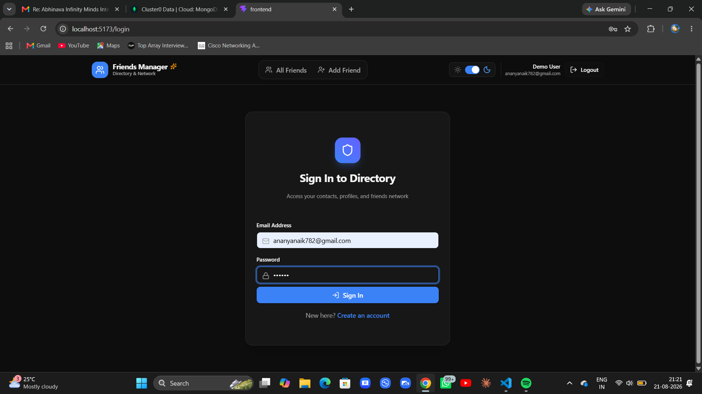
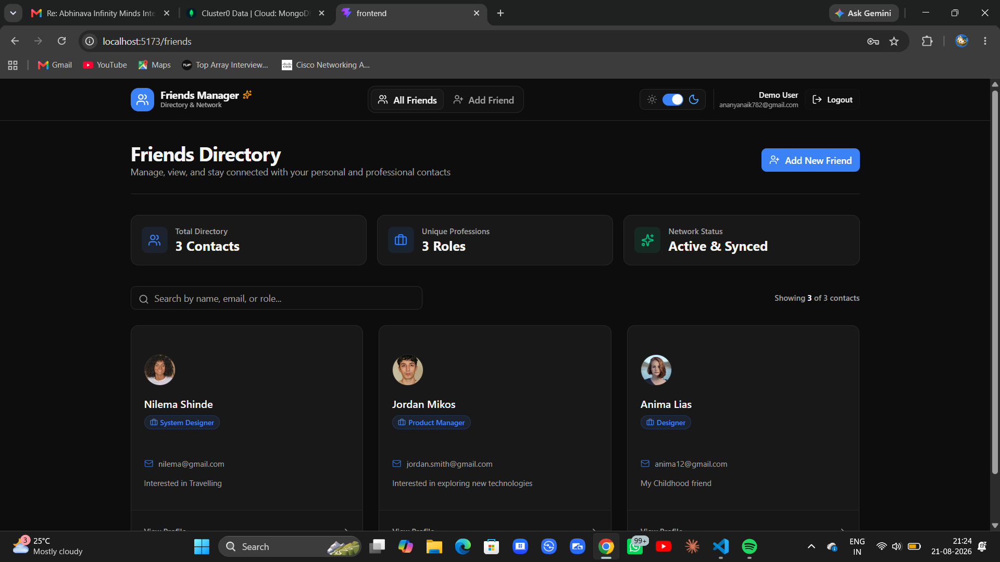
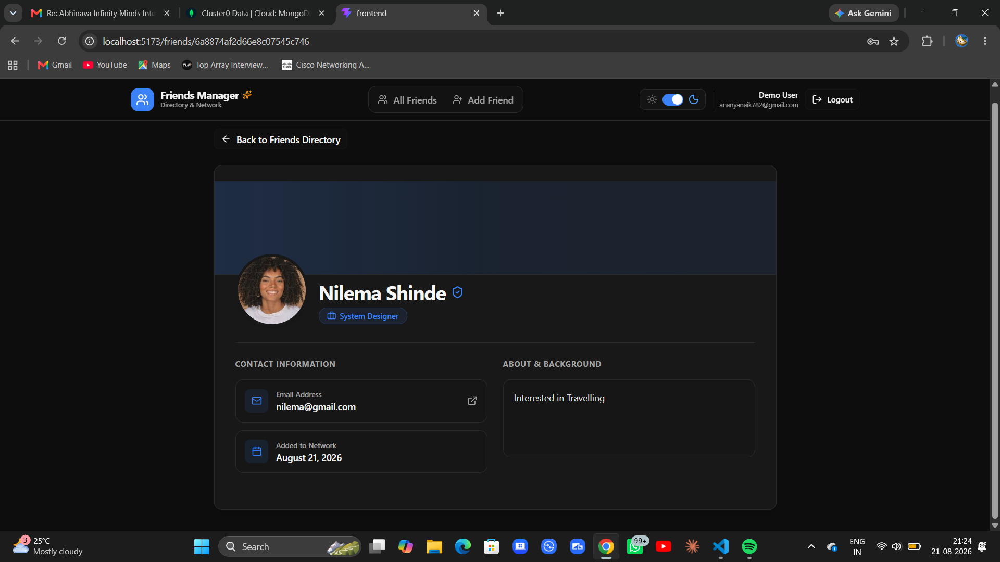

# Friends Manager

<p align="center">
  <strong>A full-stack friends directory with secure accounts and private contact lists.</strong>
</p>

<p align="center">
  <a href="#features">Features</a> &bull;
  <a href="#tech-stack">Tech Stack</a> &bull;
  <a href="#getting-started">Getting Started</a> &bull;
  <a href="#api-reference">API Reference</a>
</p>

<p align="center">
  
  
  
  
</p>

## Screenshots

<p align="center">
  
</p>

<p align="center">
  
</p>

<p align="center">
  
</p>

## Features

- Create an account or sign in with a secure bcrypt-hashed password.
- Manage a private friends directory -- contacts belong only to the account that created them.
- Add customized contacts with name, email, role, image URL, and bio.
- Open a contact card to view its dedicated profile page.
- Validate forms in both the React client and Express API using Zod.
- Use JWT-protected API routes and a narrowly configured CORS policy.
- Receive consistent API errors in the shape `{ message, status }`.

## Tech Stack

| Frontend | Backend | Database & Security |
| --- | --- | --- |
| React, Vite, React Router | Node.js, Express | MongoDB Atlas, Mongoose |
| Tailwind CSS, Lucide icons | Zod, CORS, dotenv | bcrypt, JSON Web Tokens |

## Project Structure

```text
FriendsCareer/
├── frontend/                 # React + Vite user interface
│   └── src/
│       ├── api/              # API client and gateway
│       ├── pages/            # Login, registration, directory, and detail pages
│       └── components/       # Reusable UI components
├── backend/                  # Express REST API
│   ├── src/
│   │   ├── controllers/      # Route logic
│   │   ├── db/               # Atlas connection and seed script
│   │   ├── middleware/       # JWT auth and error handler
│   │   ├── models/           # Mongoose User and Friend models
│   │   └── routes/           # API route definitions
│   └── server.js
└── README.md
```

## Getting Started

### Prerequisites

- Node.js 18 or later
- A MongoDB Atlas database

### 1. Configure the backend

Create `backend/.env` from [`backend/.env.example`](backend/.env.example), then add your own values:

```env
PORT=5000
MONGODB_URI=your-mongodb-atlas-connection-string
JWT_SECRET=a-long-random-secret
CORS_ORIGIN=http://localhost:5173
SEED_ADMIN_PASSWORD=an-optional-local-test-password
```

Never commit this file—it contains secrets and is ignored by Git.

### 2. Start the API

```bash
cd backend
npm install
npm start
```

The API runs at `http://localhost:5000`.

### 3. Start the frontend

Open another terminal:

```bash
cd frontend
npm install
npm run dev
```

Open the local Vite URL shown in your terminal, normally `http://localhost:5173`.

> **Note**
> Vite reads `VITE_API_BASE_URL` when its dev server starts. Restart `npm run dev` after changing `frontend/.env`.

## Environment Variables

| Location | Variable | Purpose |
| --- | --- | --- |
| `frontend/.env` | `VITE_API_BASE_URL` | Backend API base URL, normally `http://localhost:5000/api` |
| `backend/.env` | `PORT` | Express server port |
| `backend/.env` | `MONGODB_URI` | MongoDB Atlas connection string |
| `backend/.env` | `JWT_SECRET` | Secret used to sign access tokens |
| `backend/.env` | `CORS_ORIGIN` | Exact frontend origin allowed to call the API |
| `backend/.env` | `SEED_ADMIN_PASSWORD` | Password used only when running the optional seed command |

## API Reference

All protected endpoints require this header:

```http
Authorization: Bearer <token>
```

| Method | Endpoint | Auth | Description |
| --- | --- | --- | --- |
| `POST` | `/api/register` | No | Create an account and receive a JWT |
| `POST` | `/api/login` | No | Sign in and receive a JWT |
| `GET` | `/api/friends` | Yes | Get the signed-in user's friends |
| `GET` | `/api/friends/:id` | Yes | Get one of the signed-in user's friends |
| `POST` | `/api/friends` | Yes | Create a friend for the signed-in user |

### Example: Create a Friend

```json
{
  "name": "Alex Morgan",
  "email": "alex@example.com",
  "role": "Designer",
  "imageUrl": "https://example.com/avatar.jpg",
  "bio": "Enjoys photography and weekend hikes."
}
```

## Optional Seed User

Run the following after setting `SEED_ADMIN_PASSWORD` in `backend/.env`:

```bash
cd backend
npm run seed
```

This creates `admin@test.com` if it does not already exist. It does not create sample friends.

## Security Notes

- Passwords are stored only as bcrypt hashes.
- JWTs expire after one day.
- Friend data is scoped to its owning user at the database query level.
- CORS is restricted to the frontend origin configured in environment variables.
- Validation errors and database errors are normalized before they are returned to the client.

---

Built as an internship portfolio project.
